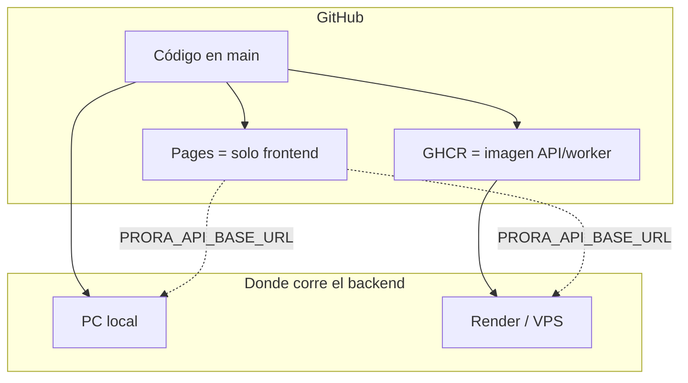

# PRORA

Sistema de apoyo a la vigilancia epidemiológica en Colombia para dengue, malaria,
chikunguña, Zika, leishmaniasis e IRA. Trabaja con series agregadas por municipio
y semana, genera pronósticos a 3–4 semanas, muestra explicabilidad y gestiona
alertas. No diagnostica y no almacena datos clínicos individuales.

Stack: React (Vite) + FastAPI + PostgreSQL/PostGIS (SQLite en desarrollo) +
worker de ingesta/entrenamiento + modelos ensemble (RF, HGB, LSTM opcional).

## Enlaces del repositorio

| Recurso | URL |
| --- | --- |
| Código | https://github.com/HCHAPS404/Proyecto-PRORA |
| Frontend en GitHub Pages | https://hchaps404.github.io/Proyecto-PRORA/ |
| Actions | https://github.com/HCHAPS404/Proyecto-PRORA/actions |
| Imagen Docker (GHCR) | https://github.com/HCHAPS404/Proyecto-PRORA/pkgs/container/proyecto-prora-api |

**Sobre GitHub Pages:** ese enlace publica solo el frontend. La API, el worker y
la base de datos no corren en Pages. Para usar mapa, fuentes y predicciones hace
falta el backend (en PC o en un host como Render) y la variable
`PRORA_API_BASE_URL`.

## Instalación en Windows (desarrollo local)

### Requisitos

- Node.js 22+ y pnpm 9 (`corepack enable`)
- Python 3.11 o 3.12
- Git
- (Opcional) Docker Desktop, si prefiere Compose en lugar de SQLite

### Paso 1 — Clonar

```powershell
git clone https://github.com/HCHAPS404/Proyecto-PRORA.git
cd Proyecto-PRORA
```

### Paso 2 — Frontend

```powershell
corepack enable
pnpm install --frozen-lockfile
```

### Paso 3 — Backend

```powershell
cd backend
python -m venv .venv
.\.venv\Scripts\Activate.ps1
pip install -e ".[dev,ml]"
# Opcional: LSTM y SHAP
# pip install -e ".[dev,ml,lstm,explainability]"
cd ..
```

### Paso 4 — Arrancar todo (API + worker + UI)

```powershell
npm run dev:full
```

Eso ejecuta `scripts/dev.ps1`: API en `:8000`, worker y Vite en `:5173` con
`VITE_API_BASE_URL=http://127.0.0.1:8000/api/v1`.

| Servicio | URL |
| --- | --- |
| UI | http://127.0.0.1:5173/ |
| OpenAPI | http://127.0.0.1:8000/docs |
| Ready | http://127.0.0.1:8000/ready |

Base por defecto: SQLite en `backend/prora.db`.

### Paso 5 — Operador (solo si va a sincronizar o entrenar por API)

```powershell
cd backend
.\.venv\Scripts\Activate.ps1
python -m app.cli create-operator --email operador@entidad.gov.co --role admin --full-name "Operador PRORA"
```

La contraseña se pide por consola (no va en el historial del comando).

### Paso 6 — Comprobar

```powershell
Invoke-RestMethod http://127.0.0.1:8000/ready
Invoke-RestMethod http://127.0.0.1:8000/api/v1/sources | Select-Object -First 3 id,status
pnpm run lint
cd backend; pytest
```

Guía ampliada: [docs/INSTALL.md](docs/INSTALL.md).

## Instalación con Docker

```powershell
Copy-Item .env.example .env
# Edite POSTGRES_PASSWORD y PRORA_JWT_SECRET
docker compose up --build
```

- App (Nginx): http://localhost:8080  
- API directa: http://localhost:8000/api/v1  

Casi producción (solo puerto web, API detrás de Nginx):

```powershell
# En .env: PRORA_ENVIRONMENT=production y secretos reales
docker compose -f docker-compose.yml -f docker-compose.prod.yml up --build -d
```

## Despliegue

Hay tres capas distintas. No las mezcle:



### A) Frontend en GitHub Pages

1. En el repo: **Settings → Pages → Source → GitHub Actions**
2. En **Actions**, ejecute *Publicar frontend en GitHub Pages* (o haga push a `main`)
3. Abra `https://hchaps404.github.io/Proyecto-PRORA/`

Sin API remota el sitio abre en modo invitado: UI sí, predicciones en vivo no.

Detalle: [docs/github-deploy.md](docs/github-deploy.md).

### B) Backend en PC (demo / defensa)

```powershell
npm run dev:full
```

Luego cree el operador, sincronice fuentes y entrene (pasos 5–8 de
[docs/INSTALL.md](docs/INSTALL.md)).

### C) Backend público + Pages conectado (ruta recomendada)

Orden fijo; no salte el paso de migraciones ni el de la variable de Pages.

| Paso | Acción | Resultado |
| --- | --- | --- |
| 1 | Push a `main` (o Run workflow *Publicar backend en GHCR*) | Imagen en `ghcr.io/hchaps404/proyecto-prora-api` |
| 2 | [Render](https://dashboard.render.com/) → **New → Blueprint** → este repo | Lee `render.yaml` (API + worker + Postgres) |
| 3 | Shell del servicio web → `./docker-entrypoint.sh migrate` | Esquema listo |
| 4 | Copie la URL HTTPS de la API (ej. `https://….onrender.com`) | Backend público |
| 5 | GitHub → **Settings → Secrets and variables → Actions → Variables** → `PRORA_API_BASE_URL=https://SU-API/api/v1` | Front sabe a dónde llamar |
| 6 | CORS en la API: `PRORA_CORS_ORIGINS=["https://hchaps404.github.io"]` | El navegador no bloquea |
| 7 | Actions → *Publicar frontend en GitHub Pages* | Build con la URL correcta |
| 8 | Login operador en esa API → sync + train | Datos y champions |

Alternativa VPS (misma imagen GHCR):

```powershell
$env:PRORA_GHCR_IMAGE = "ghcr.io/hchaps404/proyecto-prora-api:latest"
docker compose -f docker-compose.yml -f docker-compose.prod.yml -f docker-compose.ghcr.yml up -d
```

Pasos completos, checklist y límites del plan free:
[docs/backend-deploy.md](docs/backend-deploy.md) y
[docs/github-deploy.md](docs/github-deploy.md).

Diseño del sistema (componentes, secuencia, UML):
[docs/architecture.md](docs/architecture.md) · [docs/uml.md](docs/uml.md) ·
[docs/README.md](docs/README.md).
## Sincronizar datos y entrenar (resumen)

Con API y worker activos e iniciada sesión de operador:

```powershell
# Ejemplo: federación territorial abierta
Invoke-RestMethod -Method POST `
  -Uri "http://127.0.0.1:8000/api/v1/sources/sivigila-territorial-open/sync" `
  -Headers @{ Authorization = "Bearer $TOKEN" } `
  -ContentType "application/json" -Body "{}"

# Entrenamiento por enfermedad
Invoke-RestMethod -Method POST `
  -Uri "http://127.0.0.1:8000/api/v1/models/train" `
  -Headers @{ Authorization = "Bearer $TOKEN" } `
  -ContentType "application/json" `
  -Body '{"disease":"dengue","horizons":[3,4]}'
```

También: `scripts/operational-bootstrap.ps1`.

Sin SIVIGILA municipal reciente (≤ 35 días) el sistema permanece en
`research_only`: los modelos sirven para evaluación histórica, no como alerta
operativa nacional.

## Documentación

| Documento | Contenido |
| --- | --- |
| [docs/INSTALL.md](docs/INSTALL.md) | Instalación detallada |
| [docs/architecture.md](docs/architecture.md) | Arquitectura y flujos |
| [docs/uml.md](docs/uml.md) | Diagramas UML (Mermaid) |
| [docs/deployment.md](docs/deployment.md) | Operación y Compose |
| [docs/github-deploy.md](docs/github-deploy.md) | Pages y Actions |
| [docs/backend-deploy.md](docs/backend-deploy.md) | GHCR, Render, VPS |
| [docs/security.md](docs/security.md) | Seguridad y privacidad |
| [backend/docs/data-sources.md](backend/docs/data-sources.md) | Fuentes y contratos |
| [backend/app/ml/README.md](backend/app/ml/README.md) | Pipeline ML |

Índice: [docs/README.md](docs/README.md).

## Licencia y uso

El código del repositorio se entrega para evaluación y despliegue controlado.
Los datos oficiales siguen las condiciones de cada entidad (INS, IDEAM, DANE,
gobernaciones). No redistribuir microdatos nominales.
