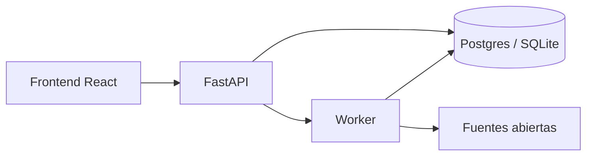

# Documentación PRORA

Índice de guías técnicas. Empiece por el README del repo y use esta carpeta
cuando necesite detalle de instalación, despliegue o diseño.

## Arranque y operación

| Documento | Cuándo usarlo |
| --- | --- |
| [INSTALL.md](INSTALL.md) | Primera instalación en PC (Windows/Linux), operador, sync y train |
| [deployment.md](deployment.md) | Docker Compose local y casi producción |
| [github-deploy.md](github-deploy.md) | GitHub Pages, Actions y variables |
| [backend-deploy.md](backend-deploy.md) | Imagen GHCR, Render Blueprint y VPS |

## Diseño y seguridad

| Documento | Cuándo usarlo |
| --- | --- |
| [architecture.md](architecture.md) | Componentes, flujos de datos y decisiones de diseño |
| [uml.md](uml.md) | Casos de uso, clases, secuencia, estados y despliegue (Mermaid) |
| [security.md](security.md) | Autenticación, roles, secretos y límites de datos |

## Datos y modelos

| Documento | Cuándo usarlo |
| --- | --- |
| [../backend/docs/data-sources.md](../backend/docs/data-sources.md) | Catálogo de fuentes, federaciones y contratos |
| [../backend/app/ml/README.md](../backend/app/ml/README.md) | Pipeline de entrenamiento e inferencia |

## Orden sugerido de lectura

1. [../README.md](../README.md) — visión general e instalación corta  
2. [INSTALL.md](INSTALL.md) — dejar API + worker + UI en el PC  
3. [uml.md](uml.md) + [architecture.md](architecture.md) — entender el sistema  
4. [github-deploy.md](github-deploy.md) + [backend-deploy.md](backend-deploy.md) — publicar  

## Diagrama rápido del sistema

Para el mapa UML completo: [uml.md](uml.md).
