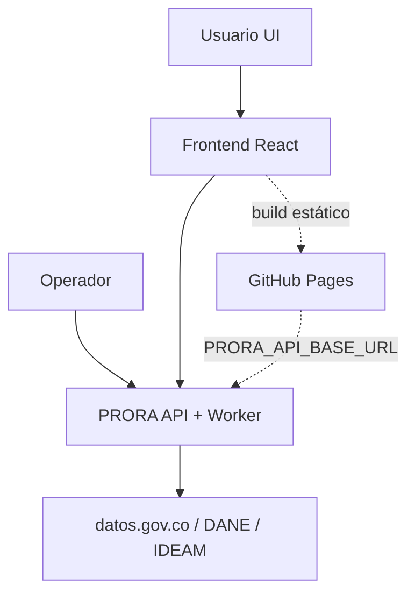
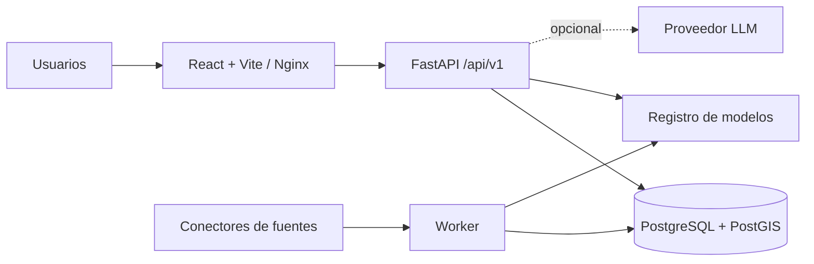
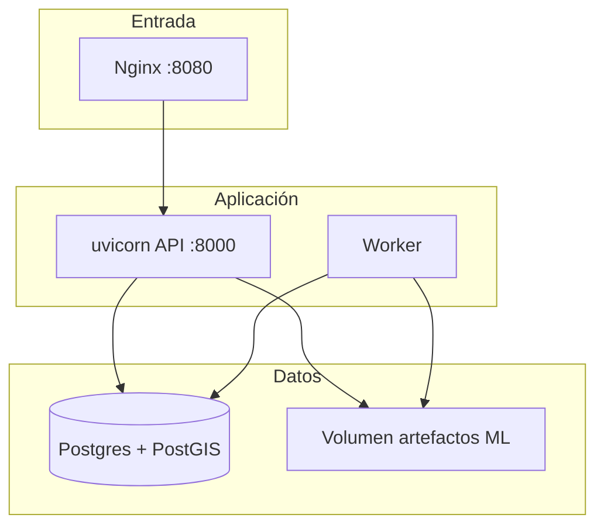
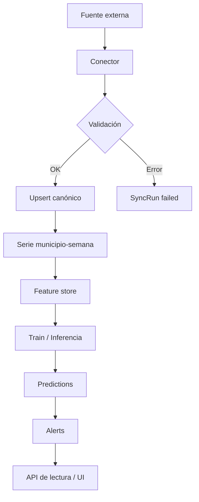
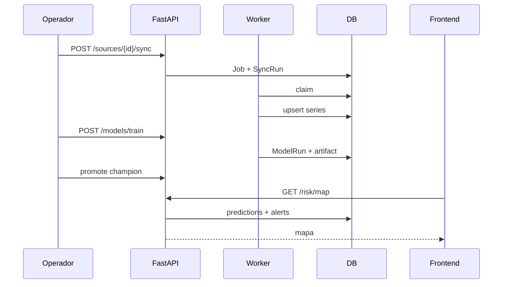
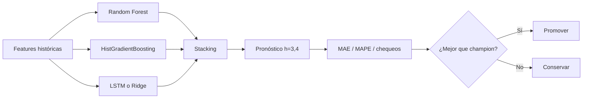
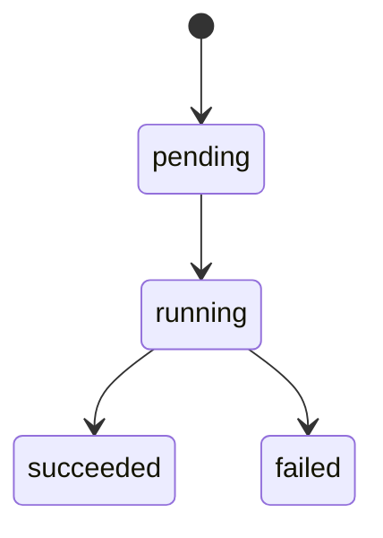
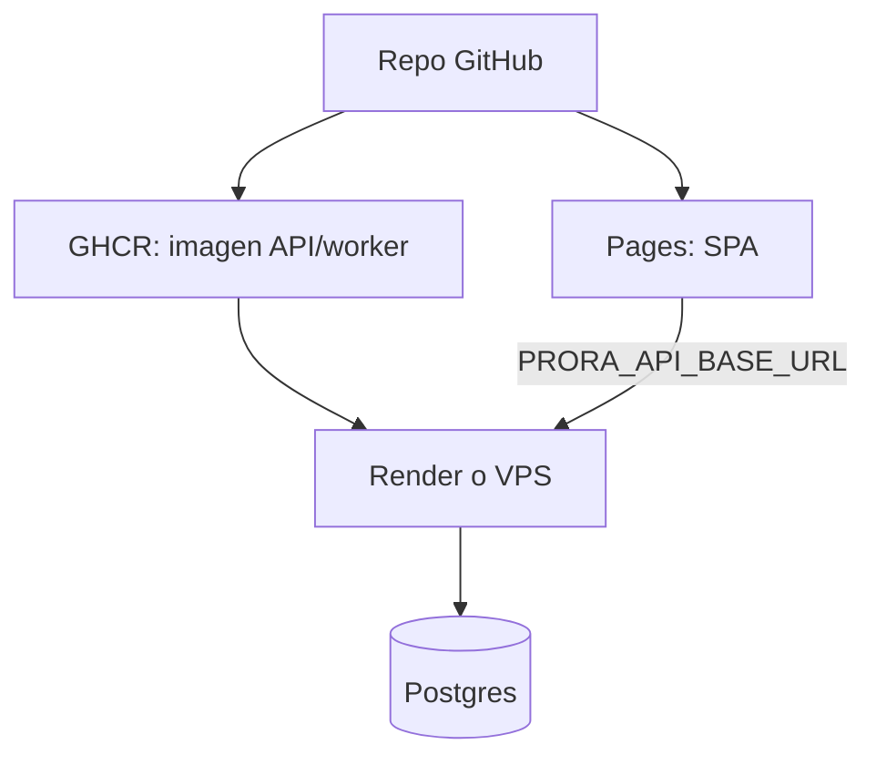

# Arquitectura de PRORA

PRORA convierte series epidemiológicas agregadas (municipio × semana) en
pronósticos a corto plazo y señales de riesgo para dengue, malaria, chikunguña,
Zika, leishmaniasis e IRA. Separa lo observado, lo predicho y lo operativo. No
guarda historias clínicas ni identifica pacientes.

Los diagramas UML detallados están en [uml.md](uml.md).

## Contexto

## Componentes

| Capa | Qué hace | Tecnología |
| --- | --- | --- |
| Presentación | Mapa, series, predicciones, alertas | React, TypeScript, Vite, Nginx |
| API | Auth, validación, OpenAPI | FastAPI, Pydantic, SQLAlchemy async |
| Persistencia | Territorios, series, jobs, modelos, auditoría | Postgres 16 + PostGIS (SQLite en dev) |
| Ingesta | Descarga, normalización, DIVIPOLA, procedencia | Conectores en `backend/app/connectors` |
| ML | Features, train, stacking, inferencia | scikit-learn, PyTorch opcional, SHAP opcional |
| Operación | Migraciones, cola, proxy, salud | Docker Compose, worker, Nginx |

## Contenedores en despliegue típico

En desarrollo local sin Docker: API y worker apuntan a `sqlite+aiosqlite` y el
frontend a `http://127.0.0.1:8000/api/v1`.

## Flujo de datos

Pasos en texto:

1. El conector descarga o consulta la fuente y guarda URL, fecha, esquema y huella.
2. Se validan tipos, rango temporal, DIVIPOLA, duplicados y completitud.
3. Las series quedan en municipio × semana epidemiológica; el clima y factores
   se alinean sin usar información futura.
4. El worker arma rezagos y variables estructurales; entrena o infiere.
5. El registro guarda artefacto, métricas y checksum. Solo un champion promovido
   alimenta predicciones “oficiales” del sistema.
6. La API expone observaciones y pronósticos por separado (horizonte, banda,
   versión del modelo).

## Secuencia resumida: sync → train → mapa

## Estrategia de predicción

- **Random Forest / HGB:** interacciones entre clima, vacunación, calidad del
  agua e indicadores estructurales.
- **Secuencial:** LSTM si hay PyTorch; si no, Ridge sobre la misma ventana.
  Nunca se etiqueta Ridge como LSTM.
- **Validación:** solo pasado respecto al punto de corte; MAE/RMSE en conteos o
  tasas; revisión por territorio cuando hay muestra suficiente.

Un artefacto entrenado no es por sí solo un modelo operativo. La promoción pide
revisar fugas temporales, calibración y utilidad en campo.

## Contratos de API

Especificación viva: `/api/v1/openapi.json` (también `/docs` con Swagger).

| Prefijo | Dominio |
| --- | --- |
| `/auth`, `/preferences` | Sesión y preferencias |
| `/risk`, `/models` | Mapa, detalle, histórico, train, readiness |
| `/sources` | Catálogo, sync, corridas |
| `/alerts`, `/subscriptions` | Reglas y suscripciones |
| `/notifications` | Bandeja in-app |
| `/agent/query` | Consultas sobre hechos agregados |
| `/health`, `/ready` | Liveness / readiness |

Errores: sobre con `code`, `message`, `details` y `request_id`.

## Jobs y notificaciones

El worker:

- reclama jobs de sync y train de forma idempotente;
- evalúa reglas de alerta solo contra pronósticos elegibles;
- canal `in_app` → `delivered`; `email` / `push` / `webhook` → `unsupported`
  hasta que haya proveedor real;
- cada ~5 minutos revisa `refresh_cron` del catálogo y encola sync si corresponde.

## Fuentes y honestidad operacional

- SIVIGILA nacional microdato reciente no siempre tiene API pública estable; el
  portal INS gestiona solicitudes.
- La federación `sivigila-territorial-open` une conjuntos municipales abiertos
  (Boyacá, Caquetá, Pereira, Tuluá, Bucaramanga, Casanare, etc.).
- DIVIPOLA viene del servicio DANE; clima e IRCA de datos.gov.co / IDEAM cuando
  el conector está habilitado.

Si falta API nacional o archivo autorizado, la fuente queda en
`requires_configuration`. No se inventan URLs ni se sustituye con un dataset
regional sin marcar el alcance.

Sin SIVIGILA municipal con corte ≤ 35 días el portfolio permanece en
`research_only`: útil para evaluación histórica, no como alerta operativa nacional.

## Decisiones de despliegue

- En Compose, Nginx sirve el front y hace proxy de `/api/v1` a FastAPI (menos
  fricción CORS).
- Migraciones corren una vez (`migrate`) antes de API y worker.
- API y worker comparten volumen de artefactos ML.
- La base no se publica a internet en producción.

Guías: [INSTALL.md](INSTALL.md), [backend-deploy.md](backend-deploy.md),
[github-deploy.md](github-deploy.md), [uml.md](uml.md).
