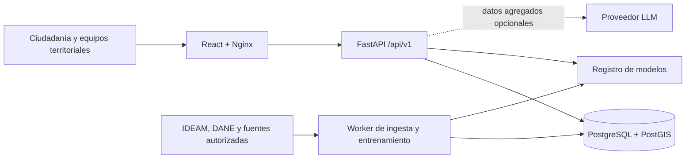

# Arquitectura de PRORA

## Objetivo y límites

PRORA transforma series municipales agregadas en señales tempranas de riesgo para
seis enfermedades priorizadas. Separa observaciones, pronósticos y decisiones
operativas; conserva procedencia y versión del modelo para que cada alerta sea
auditable. No almacena historias clínicas ni identifica pacientes.

## Vista de componentes

| Capa | Responsabilidad | Implementación |
| --- | --- | --- |
| Presentación | Mapa, histórico, predicciones, explicaciones, alertas y accesibilidad | React, TypeScript, Vite, Nginx |
| API | Contratos, autenticación, autorización, validación y OpenAPI | FastAPI, Pydantic, SQLAlchemy async |
| Persistencia | Usuarios, fuentes, observaciones, geometría, modelos, pronósticos y auditoría | PostgreSQL 16, PostGIS, Alembic |
| Ingesta | Descarga paginada, normalización, DIVIPOLA, calidad y procedencia | Conectores y contratos Python |
| ML | Features, validación, entrenamiento, ensemble, inferencia y explicabilidad | pandas, scikit-learn, PyTorch opcional, SHAP opcional |
| Operación | Migraciones, trabajo asíncrono, proxy, salud y volúmenes | Docker Compose, worker, Nginx |

## Flujo de datos

1. Un conector consulta una fuente pública o recoge un archivo institucional
   autorizado. Se guarda URL o referencia, fecha de extracción, esquema y huella.
2. La capa de ingesta valida tipos, rango temporal, DIVIPOLA, duplicados,
   completitud y consistencia territorial antes de publicar datos canónicos.
3. Las series se agregan a municipio y semana epidemiológica. Variables con otra
   periodicidad se alinean sin utilizar información futura.
4. El worker construye rezagos, estacionalidad y variables estructurales; ejecuta
   validación temporal con ventana expansiva y pruebas territoriales fuera de
   muestra.
5. El registro conserva artefacto, configuración, métricas, periodo de
   entrenamiento y checksum. Solo una versión aprobada debe promoverse a activa.
6. La API sirve observaciones y pronósticos por separado, junto con horizonte,
   incertidumbre, impulsores y versión del modelo.

## Estrategia de predicción

- **Random Forest:** interacciones no lineales entre clima, vacunación,
  deforestación e indicadores estructurales.
- **Modelo secuencial:** LSTM cuando está disponible PyTorch, con ventanas de
  12–24 semanas y rezagos climáticos; el paquete mantiene una alternativa lineal
  explícita para entornos livianos, nunca etiquetada como LSTM.
- **Ensemble:** combina predictores base con datos exclusivamente anteriores al
  punto de evaluación. Los pesos y el método quedan en el manifiesto del modelo.
- **Validación:** MAE/RMSE para conteos o tasas y AUC, sensibilidad, especificidad,
  calibración y desempeño por territorio para niveles de riesgo.

Un artefacto entrenado no equivale a un modelo epidemiológicamente aprobado. La
promoción requiere revisión de fugas temporales, calibración, deriva, desempeño
por subgrupos territoriales y utilidad operativa.

## Contratos principales

La especificación vigente se publica en `/api/v1/openapi.json`. Los dominios
principales son:

- `/auth`, `/preferences`: identidad, sesión y preferencias.
- `/risk`, `/models`: mapa, detalle municipal, histórico, explicación, metadatos
  y solicitudes de entrenamiento.
- `/sources`: catálogo, estado de conectores, sincronización y ejecuciones.
- `/alerts`, `/subscriptions`: reglas y preferencias de suscripción.
- `/notifications`: bandeja in-app y trazabilidad de cada canal evaluado.
- `/agent/query`: respuestas apoyadas solo en hechos agregados recuperados.
- `/health`, `/ready`: vida del proceso y disponibilidad de dependencias.

Los errores siguen un sobre estable con código, mensaje, detalles y `request_id`.

El worker evalúa de forma idempotente las reglas habilitadas solo contra alertas
abiertas con pronósticos marcados como operativamente elegibles. El canal
`in_app` se registra como `delivered`; `email`, `push` y `webhook` se registran
como `unsupported` con `provider_not_configured` hasta integrar un proveedor
real. Una preferencia guardada nunca se presenta como un mensaje enviado.

El mismo worker revisa cada cinco minutos los `refresh_cron` del catálogo y
encola una sola sincronización cuando el último intento es anterior al corte
programado. La ejecución conserva `scheduled_for` y la solicitud normalizada en
su procedencia; una fuente deshabilitada, pendiente de configuración o con un
trabajo ya activo nunca se encola automáticamente.

## Fuentes oficiales y honestidad operacional

- El [portal SIVIGILA del INS](https://portalsivigila.ins.gov.co/Paginas/Vigilancia-Rutinaria.aspx)
  publica productos de vigilancia, pero el acceso a microdatos se gestiona a
  través del [buscador y solicitud del INS](https://portalsivigila.ins.gov.co/buscador).
- IDEAM publica conjuntos abiertos como
  [precipitación](https://www.datos.gov.co/Ambiente-y-Desarrollo-Sostenible/Precipitaci-n/s54a-sgyg)
  y [datos de estaciones](https://www.datos.gov.co/en/Ambiente-y-Desarrollo-Sostenible/Datos-de-Estaciones-de-IDEAM-y-de-Terceros/57sv-p2fu/data).
- La división territorial se obtiene del
  [servicio oficial DIVIPOLA de DANE](https://geoportal.dane.gov.co/mparcgis/rest/services/Divipola/Serv_DIVIPOLA_MGN_2024/FeatureServer).
- Los indicadores del CNPV se documentan en el
  [catálogo de microdatos DANE](https://microdatos.dane.gov.co/catalog/643).
- La deforestación se contrasta con el
  [Sistema de Monitoreo de Bosques y Carbono del IDEAM](https://www.ideam.gov.co/nuestra-entidad/ecosistemas-e-informacion-ambiental/sistema-monitoreo-bosques-carbono).

Cuando una entidad no ofrece un API nacional estable, PRORA marca la fuente como
`requires_configuration`; no sustituye el dato con un conjunto regional ni con
una URL supuesta.

## Decisiones de despliegue

- El frontend usa `/api/v1` en el mismo origen y Nginx lo enruta a FastAPI, lo
  que reduce configuración CORS y evita exponer topología interna.
- Las migraciones corren una vez antes de API y worker.
- API y worker comparten artefactos de modelos y bandeja institucional mediante
  volúmenes; los archivos originales deben moverse luego a almacenamiento de
  objetos con retención y cifrado en un despliegue administrado.
- La base no se publica en producción. El puerto del Compose es solo para
  desarrollo local y debe eliminarse o restringirse en el manifiesto final.
