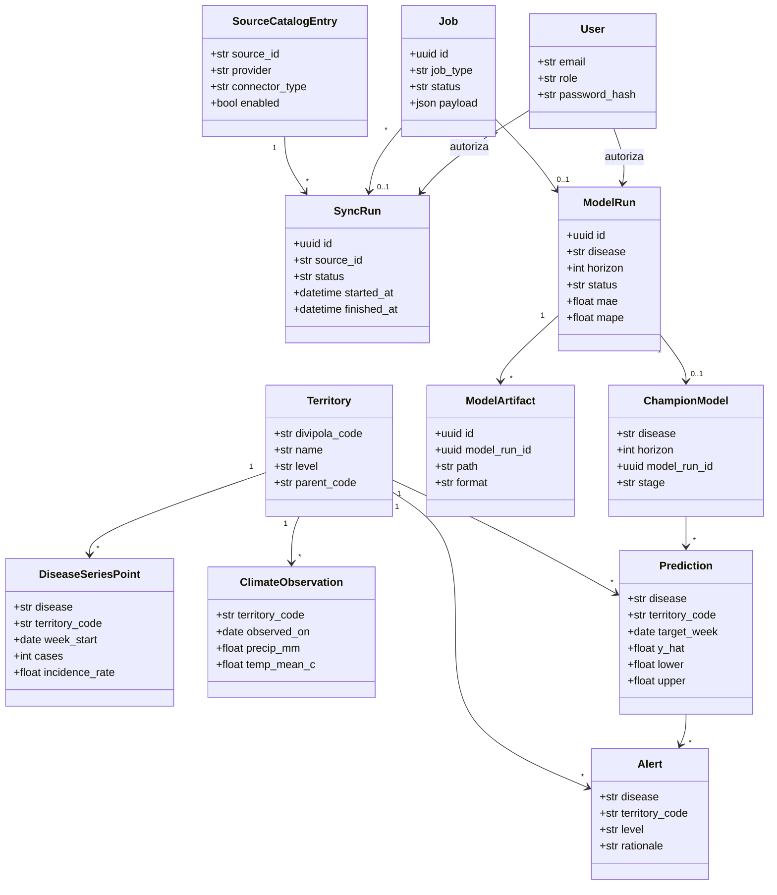
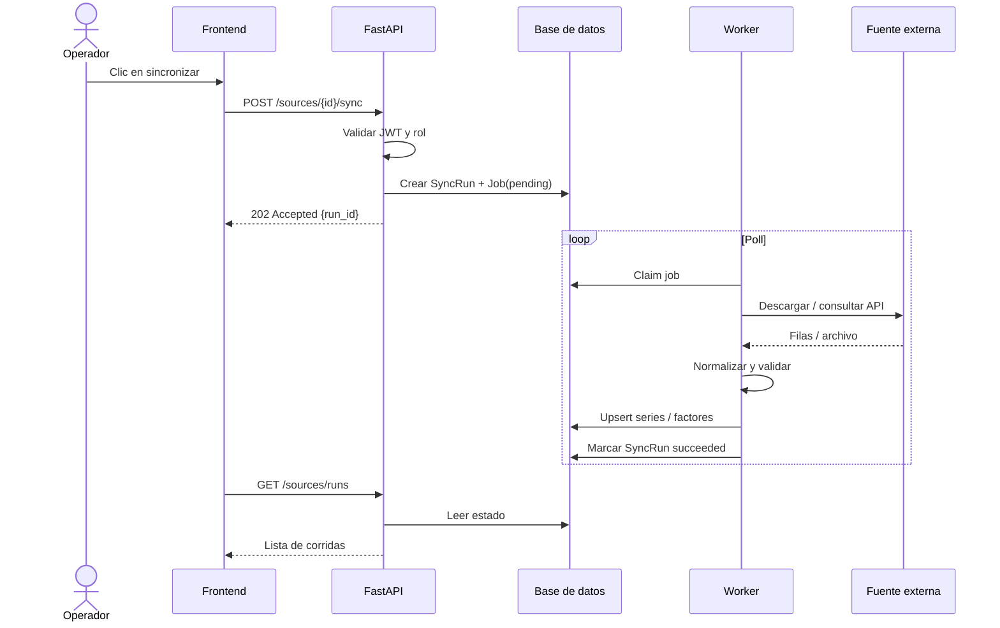
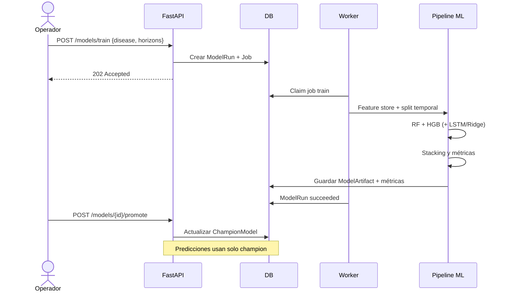
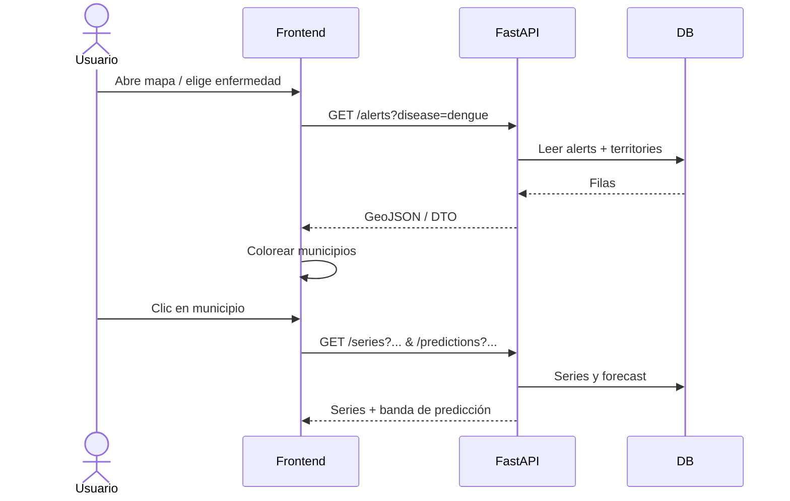
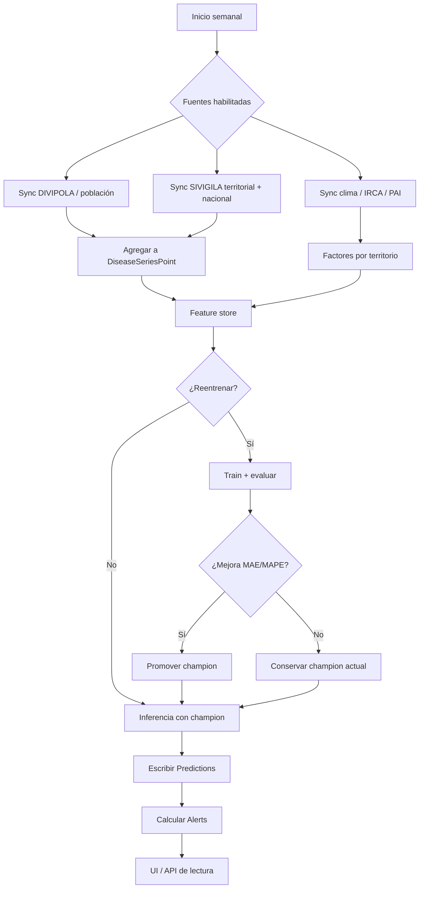
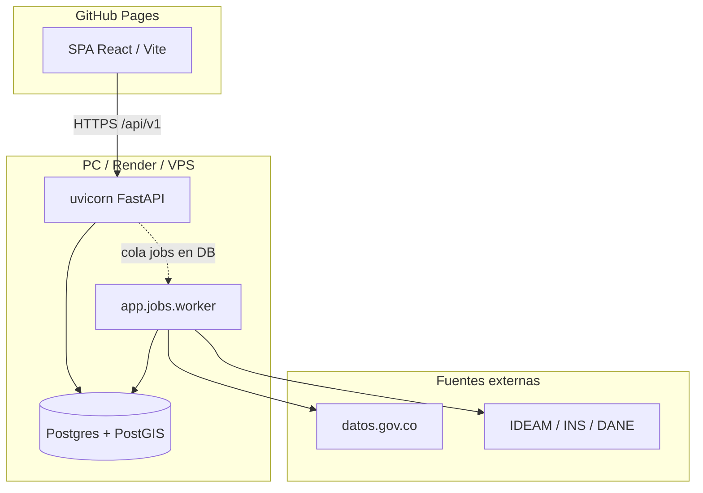
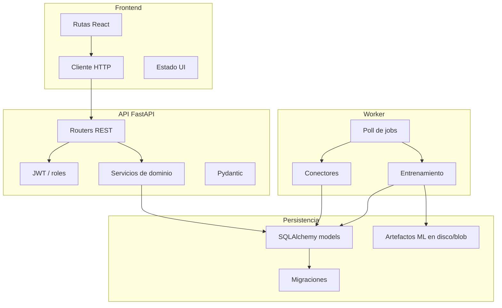
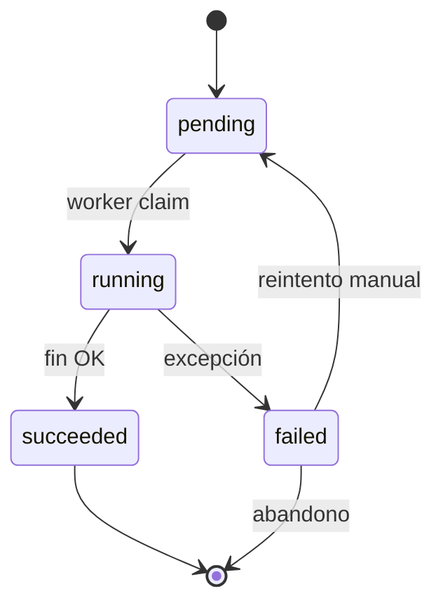
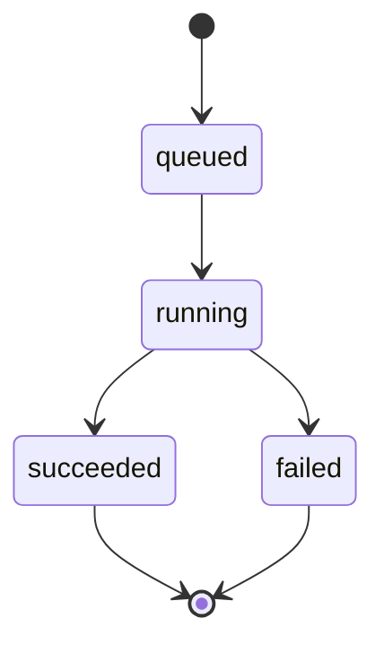

# Diagramas UML (Mermaid)

Vista de diseño del sistema. Los diagramas usan sintaxis Mermaid compatible
con GitHub, VS Code y la mayoría de visores Markdown.

## 1. Casos de uso

```mermaid
usecaseDiagram
  actor Operador
  actor Admin
  actor Publico as "Visitante (solo UI)"
  actor Sistema as "Worker / cron"

  package "PRORA" {
    usecase UC1 as "Consultar mapa y alertas"
    usecase UC2 as "Ver series y analítica"
    usecase UC3 as "Iniciar sesión"
    usecase UC4 as "Sincronizar fuentes"
    usecase UC5 as "Entrenar modelos"
    usecase UC6 as "Promover champion"
    usecase UC7 as "Gestionar usuarios"
    usecase UC8 as "Procesar cola de jobs"
    usecase UC9 as "Generar predicciones"
  }

  Publico --> UC1
  Publico --> UC2
  Operador --> UC3
  Operador --> UC1
  Operador --> UC2
  Operador --> UC4
  Operador --> UC5
  Admin --> UC6
  Admin --> UC7
  Admin --> UC4
  Admin --> UC5
  Sistema --> UC8
  Sistema --> UC9
  UC4 ..> UC8 : incluye
  UC5 ..> UC8 : incluye
  UC9 ..> UC1 : alimenta
```

## 2. Diagrama de clases (dominio principal)



## 3. Secuencia: sincronización de fuente



## 4. Secuencia: entrenamiento y promoción



## 5. Secuencia: consulta de alerta en el mapa



## 6. Actividad: pipeline de datos semanal



## 7. Despliegue (nodos)


## 8. Componentes (capa de software)



## 9. Estados de un Job



## 10. Estados de SyncRun / ModelRun



## Relación con el código

| Concepto UML | Ubicación aproximada |
| --- | --- |
| Connectors | `backend/app/connectors/` |
| Worker | `backend/app/jobs/worker.py` |
| Modelos ORM | `backend/app/models/` |
| Routers | `backend/app/api/` |
| Pipeline ML | `backend/app/ml/` |
| UI mapa / analítica | `src/` (componentes React) |
